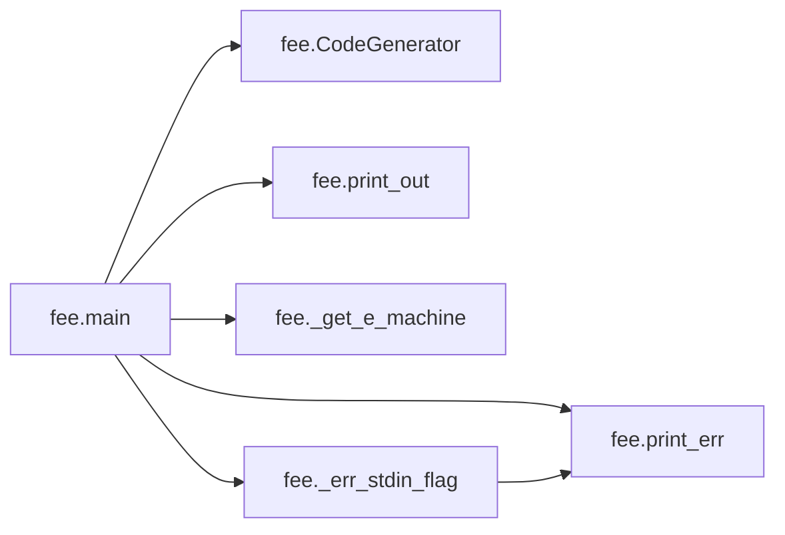
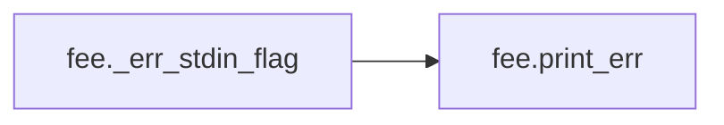

# Key Objects

[_Documentation generated by Documatic_](https://www.documatic.com)

<!---Documatic-section-fee.print_out-start--->
## fee.print_out

<!---Documatic-section-print_out-start--->
<!---Documatic-block-fee.print_out-start--->
<details>
	<summary><code>fee.print_out</code> code snippet</summary>

```python
def print_out(what: str) -> None:
    sys.stdout.write(what)
    sys.stdout.flush()
```
</details>
<!---Documatic-block-fee.print_out-end--->
<!---Documatic-section-print_out-end--->

# #
<!---Documatic-section-fee.print_out-end--->

<!---Documatic-section-fee._get_e_machine-start--->
## fee._get_e_machine

<!---Documatic-section-_get_e_machine-start--->
<!---Documatic-block-fee._get_e_machine-start--->
<details>
	<summary><code>fee._get_e_machine</code> code snippet</summary>

```python
def _get_e_machine(header: bytes) -> int:
    if header[5] == 1:
        endianness = '<'
    else:
        endianness = '>'
    (_, machine) = struct.unpack(f'{endianness}16xHH', header)
    return machine
```
</details>
<!---Documatic-block-fee._get_e_machine-end--->
<!---Documatic-section-_get_e_machine-end--->

# #
<!---Documatic-section-fee._get_e_machine-end--->

<!---Documatic-section-fee.print_err-start--->
## fee.print_err

<!---Documatic-section-print_err-start--->
<!---Documatic-block-fee.print_err-start--->
<details>
	<summary><code>fee.print_err</code> code snippet</summary>

```python
def print_err(what: str) -> None:
    sys.stderr.write(what)
    sys.stderr.flush()
```
</details>
<!---Documatic-block-fee.print_err-end--->
<!---Documatic-section-print_err-end--->

# #
<!---Documatic-section-fee.print_err-end--->

<!---Documatic-section-fee.main-start--->
## fee.main

<!---Documatic-section-main-start--->


### Object Calls

* fee.CodeGenerator
* fee.print_out
* fee.print_err
* fee._get_e_machine
* fee._err_stdin_flag

<!---Documatic-block-fee.main-start--->
<details>
	<summary><code>fee.main</code> code snippet</summary>

```python
def main() -> int:

    def patched_help_call(self, parser, namespace, values, option_string=None):
        parser.print_help(file=sys.stderr)
        parser.exit()
    argparse._HelpAction.__call__ = patched_help_call
    syscall_numbers = {**dict.fromkeys(['autodetect', 'libc'], -1), **dict.fromkeys(['386', 3], 356), **dict.fromkeys(['amd64', 62], 319), **dict.fromkeys(['arm', 40], 385), **dict.fromkeys(['arm64', 'riscv64', 183], 279), **dict.fromkeys(['mips', 8], 4354), **dict.fromkeys(['mips64', 'mips64le', 8], 5314), **dict.fromkeys(['ppc', 'ppc64', 20], 360), **dict.fromkeys(['s390x', 22], 350), **dict.fromkeys(['sparc64', 2, 18, 43], 348)}
    parser = argparse.ArgumentParser(description='Print code to stdout to execute an ELF without dropping files.')
    parser.add_argument('path', type=str, help="path to the ELF file (use '-' to read from stdin at runtime)")
    arch_or_syscall_group = parser.add_mutually_exclusive_group()
    arch_or_syscall_group.add_argument('-t', '--target-architecture', metavar='ARCH', help='target platform for resolving memfd_create (default: detect from ELF)', choices=[k for k in syscall_numbers if isinstance(k, str)], default='autodetect')
    arch_or_syscall_group.add_argument('-s', '--syscall', metavar='NUM', type=int, help='syscall number for memfd_create for the target platform')
    parser.add_argument('-a', '--argv', help='space-separated arguments (including argv[0]) supplied to execle (default: path to file as argv[0])')
    parser.add_argument('-l', '--language', metavar='LANG', help='language for the generated code (default: python)')
    parser.add_argument('-c', '--with-command', action='store_true', help='wrap the generated code in a call to an interpreter, for piping directly into ssh')
    parser.add_argument('-p', '--interpreter-path', metavar='PATH', help="path to interpreter on target if '-c' is used, otherwise a sane default is used")
    parser.add_argument('-w', '--wrap', metavar='CHARS', type=int, help='when base64-encoding the elf, how many characters to wrap to a newline (default: 0)', default=0)
    parser.add_argument('-z', '--compression-level', metavar='LEVEL', type=int, help='zlib compression level, 0-9 (default: 9)', choices=range(0, 10), default=9)
    args = parser.parse_args()
    argv = args.argv
    try:
        use_stdin = False
        if args.path == '-':
            use_stdin = True
        if use_stdin:
            if not argv:
                return _err_stdin_flag('argv', 'a')
            if not args.target_architecture or args.target_architecture == 'autodetect':
                return _err_stdin_flag('arch', 't')
        if not argv:
            argv = os.path.basename(args.path)
        if args.interpreter_path and (not args.with_command):
            print_err("note: '-p' flag meaningless without '-c'\n")
        if not use_stdin:
            with open(args.path, 'rb') as elf_file:
                elf = elf_file.read()
        else:
            elf = None
        code_generator = CodeGenerator()
        code_generator.compression_level = args.compression_level
        code_generator.wrap = args.wrap
        code_generator.use_stdin = use_stdin
        if args.target_architecture == 'autodetect' and (not use_stdin):
            args.target_architecture = _get_e_machine(elf[:20])
        if args.target_architecture != 'libc':
            syscall = syscall_numbers.get(args.target_architecture)
        else:
            syscall = args.syscall
        code_generator.syscall = syscall
        if args.language:
            code_generator.set_lang(args.language)
        out = code_generator.generate(elf, argv)
        if args.with_command:
            out = code_generator.with_command(path=args.interpreter_path)
        print_out(out)
    except Exception as exception:
        print_err(f'{exception.__str__()}\n')
        print_err('Use --help for more information.\n')
        return 1
    return 0
```
</details>
<!---Documatic-block-fee.main-end--->
<!---Documatic-section-main-end--->

# #
<!---Documatic-section-fee.main-end--->

<!---Documatic-section-fee._err_stdin_flag-start--->
## fee._err_stdin_flag

<!---Documatic-section-_err_stdin_flag-start--->


### Object Calls

* fee.print_err

<!---Documatic-block-fee._err_stdin_flag-start--->
<details>
	<summary><code>fee._err_stdin_flag</code> code snippet</summary>

```python
def _err_stdin_flag(name, flag) -> int:
    print_err(f"error: {name} ('-{flag}') is required when using stdin\n")
    print_err('Use --help for more information.\n')
    return 1
```
</details>
<!---Documatic-block-fee._err_stdin_flag-end--->
<!---Documatic-section-_err_stdin_flag-end--->

# #
<!---Documatic-section-fee._err_stdin_flag-end--->

[_Documentation generated by Documatic_](https://www.documatic.com)